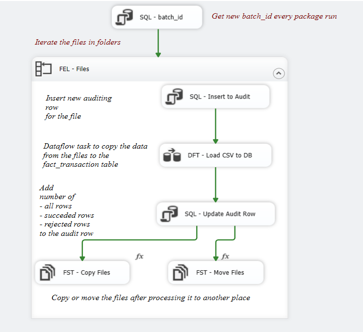
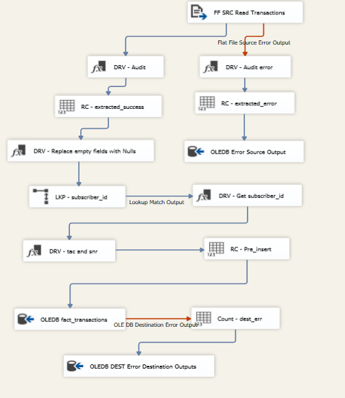
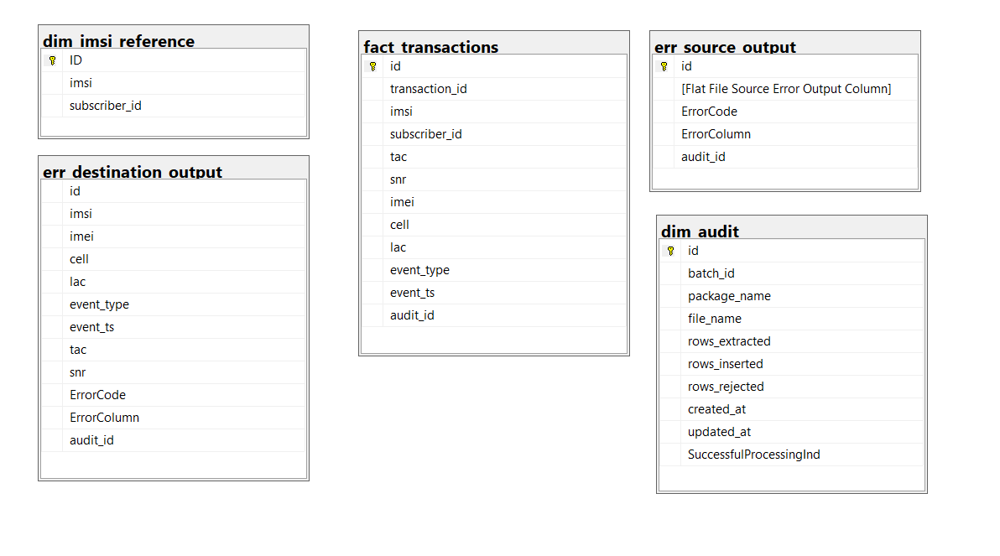

# Telecom - ETL

## Table of contents
- [Telecom - ETL](#telecom---etl)
  - [Table of contents](#table-of-contents)
  - [Introduction](#introduction)
  - [Tools](#tools)
  - [Package Design](#package-design)
    - [Control Flow](#control-flow)
    - [Data Flow](#data-flow)
  - [Database Schema Design](#database-schema-design)
  - [Usage](#usage)

## Introduction

**Telecom-ETL** is an ETL Package that extracts and ingests event data from multiple telecomunication industry files and stores the data in a relational database.

## Tools
SQL Server - SSIS (SQL Server Integration Services)

## Package Design

It consist of Control Flow and Data Flow

### Control Flow

  

* Every run for the package we get new batch_id depending on the last batch_id at the `audit_dim`
* Iterates the data files to extract data from it
* Inserting a new record in the audit dimension includes `batch_id`, `package name`, `file name`
* Executing the data flow task which makes the files data to the database and get the required auditing data like rejected_rows, inserted_rows and all_rows processed
* Updating the auditing record with the number of proccessed rows, rejected rows and inserted rows
* Moving the processed files to another location (**Archiving**)

### Data Flow

  

 
* Reading the data from the files and check if it is matched with the data quality rules we made
* If it is rejected from source, it will be stored in `err_source_output` table
* If it is matched with the distenation constraints, it will be inserted
* If it is not matched, it will ne recorded in the `err_destination_output` table
* Getting the number of rejected and inserted data for auditing purposes
* Mapping the audit_id to the tables audit_id
* Making the required derived columns like tac, snr columns from `imei` column

## Database Schema Design

  

## Usage

1. Setup SQL Server Data tools and the sql server integration service
2. Open the package with SSDT and run the package
3. Make sure to check the folder location of the files.

